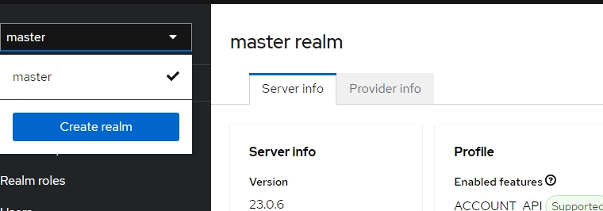
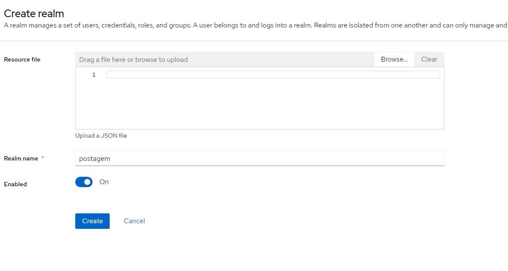
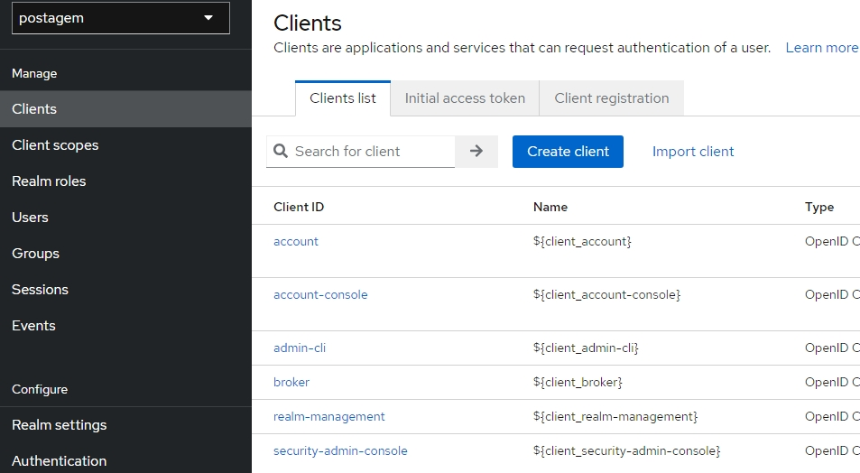
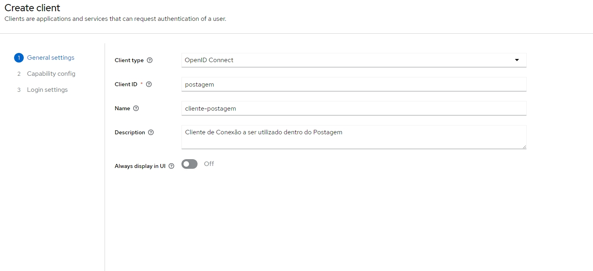
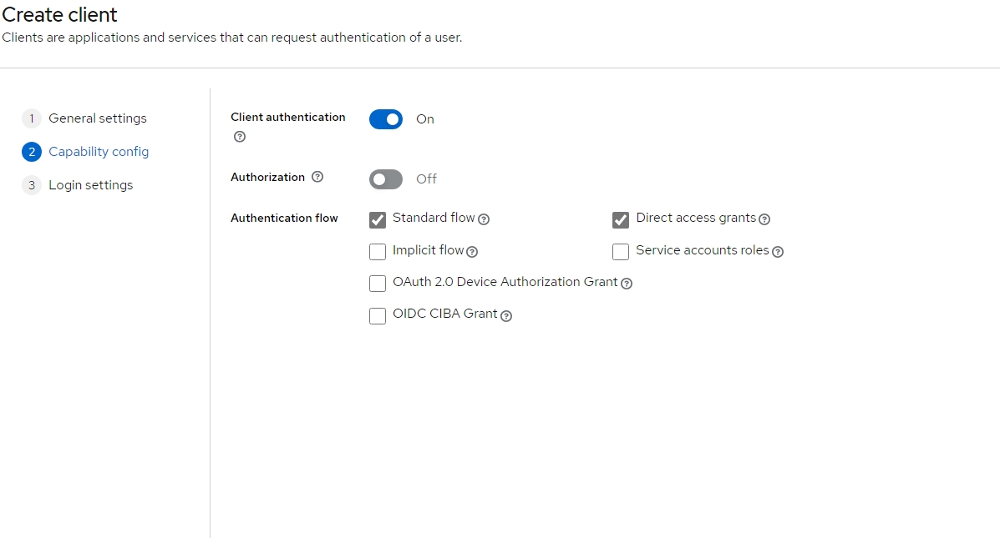
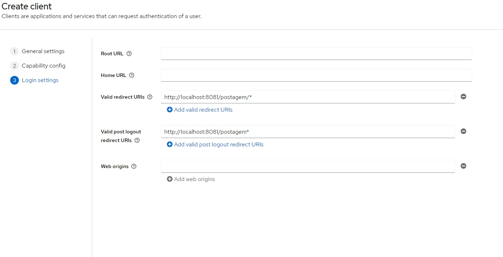
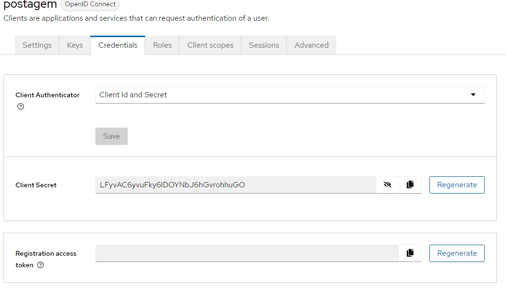
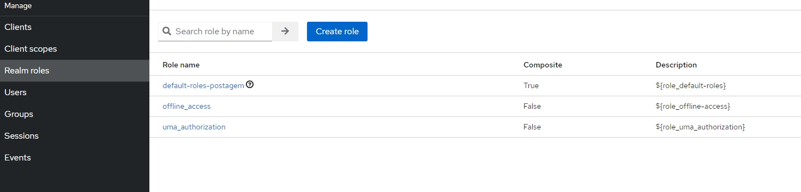
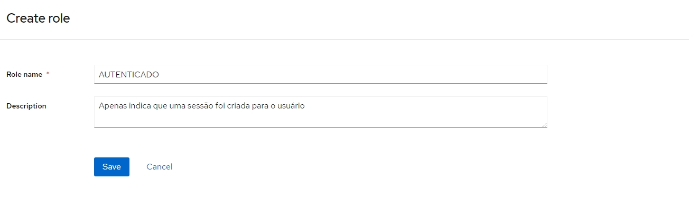

== Criação de Realm de Trabalho

=== Crie um REALM com o nome postagem
  

=== Escreva o Nome do REALM, nesse caso, postagem.
  

=== Crie um Cliente
  

=== Crie um Cliente para o Postagem
  

=== Configure esse cliente
  

=== Login Settings
  

=== Client Secret
 
LFyvAC6yvuFky6lDOYNbJ6hGvrohhuGO

=== Role
 

=== Role Name
 

